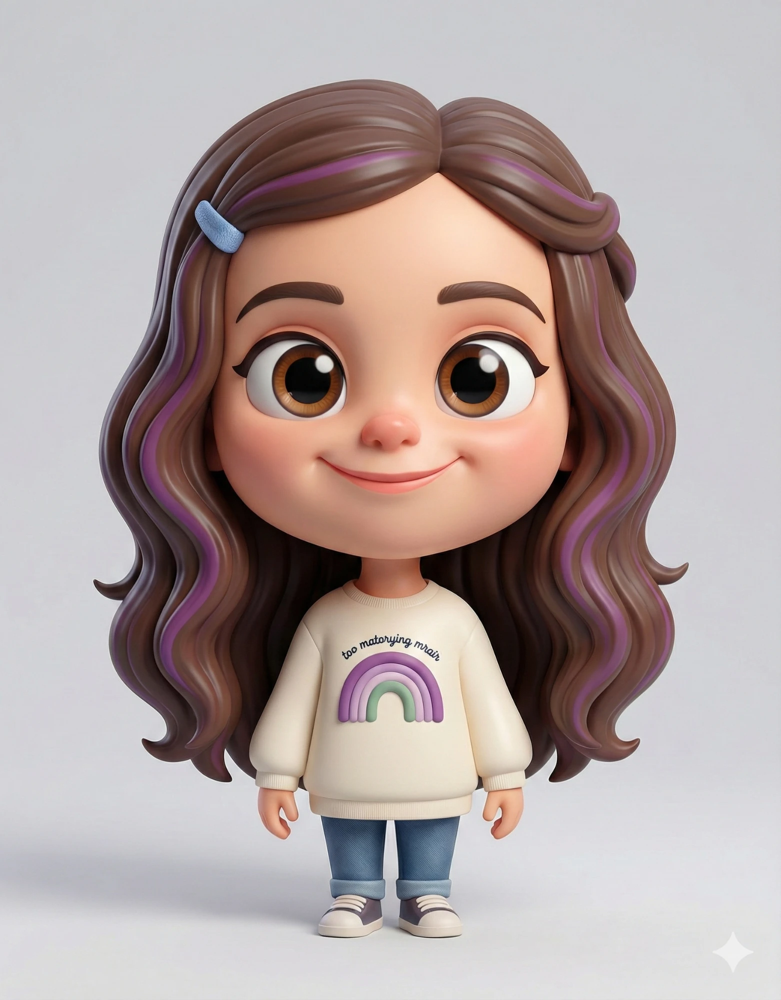

# Alma



> A cute girl with long wavy purple-streaked hair and **super dance powers**: when she dances, a rainbow dance floor lights up under her feet, sparkles twinkle around her and music notes float into the air.

## Who she is

Alma is a bright, cheerful kid with a shy streak. She's quiet until the music starts. Then her eyes turn to stars, the floor starts glowing, and nobody can keep still.

- **Wants:** everyone dancing with her.
- **Super dance powers (`power`):** a rainbow dance-floor ring that pulses on the beat, a soft pink-lilac glow, twinkling sparkles orbiting her and music notes (♪ ♫ ♬) floating up. With `eyes: 'star'` (or `'heart'`) she is in full dance mode.
- **Moves (`almaDance`):** bounce, sway, disco, twirl (she spins right round and shows the back of her head), star jump, floss and arm wave.
- **Bad at:** standing still. Also a little shy with grown-ups at first.
- **Voice / acting:** a soft giggle and quick smiles. When shy, she tucks her hands in and looks away, and she blushes easily. When excited, she goes wide-eyed with hands to her cheeks.

## Look

Chibi proportions: her head and long hair make up about half her height and are twice as wide as her body.
- **Hair:** long, wavy, chocolate-brown hair with purple streaks, parted just right of centre and falling past her shoulders. A blue clip sits on screen-left.
- **Face:** a round face with a big forehead. Huge brown eyes with lashes and a flick at the outer corners, soft arched brows, rosy cheeks, a little button nose and a sweet closed smile.
- **Outfit:** a cream crew-neck sweatshirt (ribbed collar, hem and cuffs) with a purple, lilac and sage rainbow on the chest and a line of tiny script above it. Blue jeans with rolled cuffs, and cream sneakers with purple-grey uppers.

| Part | Colour |
|---|---|
| Skin / cheeks / nose | `#F6C9AC` · `#F29A8E` · `#EFA893` |
| Hair / streaks / clip | `#5B3C2D` · `#8F5CB3` · `#6F8FCB` |
| Eyes (iris) | `#8A5024` |
| Sweatshirt | `#F4EEDF` (ribbing `#DCD2BE`) |
| Rainbow | purple `#9B6BC0` · lilac `#C7A6DB` · sage `#84A98C` |
| Jeans / cuffs | `#4F6E9F` · `#7F9CC7` |
| Sneakers | cream `#F2EDE2` · upper `#5D5470` |
| Ink (outlines) | `#3B2530` (shared with the cast) |

## Proportions and scale

She is about **23.8 local units** tall (feet to hair top). `ALMA_UNIT = 5.0` world units per unit, so in a set she stands about 120 world units tall: kid-sized, reaching to about Fester's chest. Use `s = ALMA_UNIT * P.k(Z)`.

| Landmark | Local y (up is negative) |
|---|---|
| feet | 0 |
| hips / sweatshirt hem | −4.2 |
| shoulders | −9.4 |
| chin | −11.6 |
| mouth | −12.6 |
| eyes | −15.5 |
| head centre | −16.0 |
| hair top | ≈ −23.8 |
| hair width | ±8 (to ±9 at the tips) |

Her arms are short, so her hands can't reach above her head. "Arms up" means out to the sides at about `(±5, −11)`.

Handy hand targets (wrists; mirror x for the left hand):
- rest `(±3.4, −4.9)`
- wave hi `(4.2, −12.2)` with `'palm'`
- hands to cheeks `(±1.1, −11.6)`
- hands tucked, shy `(±0.5, −4.6)`
- disco point `(4.9, −13.4)` with `'point'`
- speech-bubble anchor beside the head `(±6, −16)`

## Poses

Registered in `alma.js` (`CHARACTERS.alma.poses`) and shown in the studio's character browser and model sheet:
rest · hi! · talk · giggle · surprised · wink · shy · sad · skip · dance: bounce · dance: disco · dance: twirl · dance: star jump · dance: floss · super dance.

## Rig API (`alma.js`)

```js
const A = alma(x, y, s, {
  // body
  dy, lean, tilt, turn, rot, jump, sq, flip, breathe,
  spin,                        // rad: twirl; shows her back while cos(spin) < 0
  hairSwing,                   // -1..1: hair swings out to that side
  // limbs: IK wrist / ankle targets in local units
  handL: [x, y], handR: [x, y],
  handPoseL, handPoseR,        // 'open' | 'palm' | 'point' | 'fist'
  footL, footR,
  // face
  eyes,                        // open | wide | happy | closed | wink | squeeze | star | heart
  lookX, lookY,
  blink,                       // auto-blinks every ~3.1 s unless given
  brows,                       // normal | up | worried | angry
  mouth,                       // smile | grin | open | o | O | flat | frown | smirk | wobble
  blush,                       // 0..1, default .8
  // powers
  power,                       // 0..1: rainbow floor ring (pulses on the beat), glow, sparkles, floating music notes
  // extras
  emote, emoteK,               // '?' | '!' | 'sweat' | 'music' | 'heart'
});
// A (screen px): head, mouth, top, eyeL, eyeR, chest, belly, handL, handR, footL, footR

almaDance(t, move, { bpm = 112, k = 1 })   // pose options for a dance move (spread them into alma)
// move: 'bounce' | 'sway' | 'disco' | 'twirl' | 'star jump' | 'floss' | 'arm wave'
alma(x, y, s, { ...almaDance(t, 'disco', { bpm: 120 }), power: 1, eyes: 'star' });

almaSkip(p, k)                           // skip-cycle pose options: p = steps travelled (distance / ~44 world units), k = amount 0..1
almaLollipop(x, y, s, { ang, bite })     // her swirly lollipop prop, gripped at screen (x, y); s = px per Alma unit (any holder)
```

**Animating her:**
- **Moves:** the moves are pure functions of `t` on a beat grid. Set `bpm` to match the scene's tempo, and ramp `k` from 0 to 1 to ease into a move.
- **Powers:** ramp `power` in with `ease(seg(t, a, b))`, and switch `eyes` to `'star'` on the beat when the power kicks in. The floor ring pulses on the scene's `bpm` through `pulse(t)`.
- **Changing moves:** crossfade by interpolating the two pose objects with `mixPt` for the hands and feet, or cut on a beat.

## Files

| File | What |
|---|---|
| `asset.js` | manifest: title, logline, files, docs, reference art |
| `alma.js` | the rig, her dance powers (floor ring, sparkles, notes), `almaDance` and registered poses |
| `reference.webp` | reference art (the look we match) |
