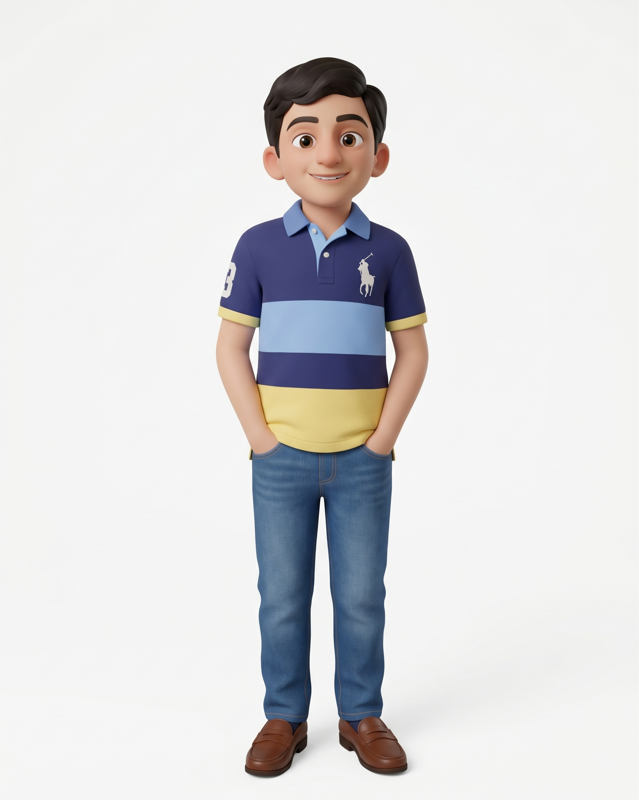

# Danny



Danny is a funny **six-year-old boy** who loves soccer and Minecraft. He turns a missed kick into a joke, celebrates every goal, and proudly shows off his latest block tower. His humor is playful and friendly.

His drawing is a 2D interpretation of the supplied reference, built from Housam's drawing and two-bone IK rig. Danny has a shorter child silhouette, a big expressive face, warm skin, brown eyes, thick brows, and dark hair swept into a side-parted quiff. He wears a navy polo with a light-blue collar and stripe, yellow hem and cuffs, a tiny horse-and-rider chest emblem, blue jeans, and brown loafers.

| Part | Colour |
|---|---|
| Skin / shadow | `#E5B393` / `#C58D73` |
| Hair | `#302622` |
| Polo / stripe / yellow trim | `#353969` / `#8BB1D9` / `#E8CF74` |
| Jeans | `#426E92` |
| Loafers | `#854831` |

Danny is about **29 local units** tall. `DANNY_UNIT = 4.2` makes him about **122 world units** tall, shorter than teenage Housam. `(x, y)` is the floor point between his feet; `s` is pixels per local unit. In a perspective set, use `s = DANNY_UNIT * P.k(Z)`.

```js
const A = danny(x, y, s, {
  t, dy, lean, tilt, turn, rot, jump, sq, flip, breathe,
  handL, handR, footL, footR, // [x, y] targets in local units
  handPoseL, handPoseR,       // 'open' | 'palm' | 'point' | 'fist'
  eyes,                     // 'open' | 'wide' | 'happy' | 'closed' | 'wink' | 'squeeze'
  brows,                    // 'normal' | 'up' | 'focused' | 'worried'
  mouth,                    // 'smile' | 'smirk' | 'grin' | 'open' | 'o' | 'flat' | 'frown' | 'wobble'
  lookX, lookY, blink, blinkSeed, blush, boil, noShadow,
});
// Screen-pixel anchors: head, mouth, top, eyeL, eyeR, chest, belly,
// handL, handR, footL, footR, kneeL, kneeR.

dannyBall(x, y, s, { spin, radius }); // Screen-space soccer ball centre.
dannyBlock(x, y, s, { ang });        // Screen-space Minecraft-inspired grass block centre.
dannyDribble(p, k);                 // Pure pose options; p = distance / stride.
```

Hands and feet use independent two-bone IK. The block and ball are optional props, so scenes can use the same outfit for soccer, building, or comedy. All poses are deterministic functions of time.

Registered poses: rest, hello, pockets, ready, dribble, kick, builder, block tower, goofy, goal!, laugh, surprised.

| File | Purpose |
|---|---|
| `asset.js` | Studio manifest and voice profile |
| `danny.js` | Drawing function, props, movement helper, and poses |
| `reference.jpeg` | Supplied visual reference |
