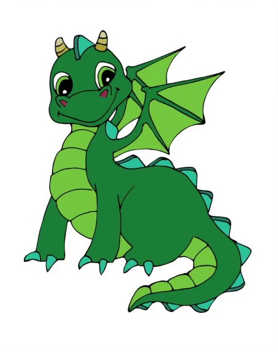
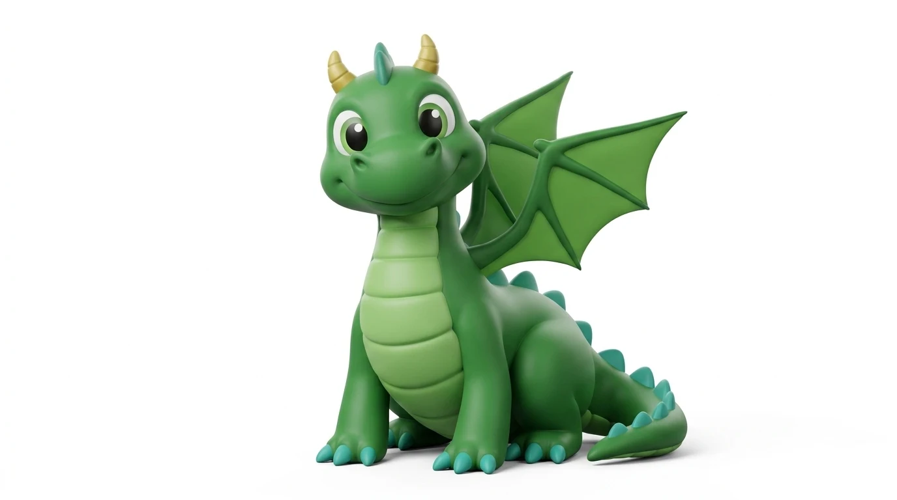

# Dragon




> A funny, docile dragon who is curious to learn and can fly.

## Who Dragon is

Dragon asks many questions, listens carefully, and gets delighted when a new idea clicks. The jokes come from earnest misunderstandings, gentle giggles, and sometimes an overenthusiastic wing flap. Dragon can lift off, hover while listening, and fly to find the answer to a question. Dragon is never threatening; even the claws and horns look soft and small.

## Look

The drawing establishes the bold cartoon shapes and teal accents; the rendered picture helps with the round volume and soft, friendly face. The rig uses a plump pear-shaped green body, long segmented lime belly, broad bat-like lime wings with dark green ribs, a curled tail with teal spikes, three-clawed paws, two small golden horns, and large white eyes. The palette and plum-free green ink keep Dragon distinct from Fester while sharing the project's outlined cartoon style.

| Part | Colour |
|---|---|
| Body / shadows | `#258343` / `#176737` |
| Belly plates | `#A8DB67` / `#79BA4D` |
| Wings | `#83CF5A` / `#278548` ribs |
| Spikes and claws | `#40B7A3` |
| Horns | `#E6D477` |
| Ink | `#284334` |

## Proportions and scale

The feet are at local `y = 0`, the head is near `y = -21`, and the horns reach about `y = -27`. `DRAGON_UNIT = 6.3` gives a standing height of about 170 world units. In a location, draw at a world depth `Z` with `s = DRAGON_UNIT * P.k(Z)` and place the rig at `P.p(X, 0, Z)`.

The wings can extend to about 36 local units across when open. `CHARACTERS.dragon.size` allows extra room above the horns for lifted flying poses in the studio.

## Poses

The studio lists: rest, curious, listening, thinking, hello!, giggle, surprised, shy, wings open, hover, fly, and land. The flying poses flap their wings and bob without relying on previous frames, so they scrub and render out of order correctly.

## Rig API

```js
const A = dragon(x, y, s, {
  t,                   // optional time override; otherwise the current frame time
  flip, rot, lean, sq, // mirror, whole-body rotation, lean, squash
  jump, fly,           // height in local units; fly 0..1 tucks the paws
  wings, flap,         // spread 0..1; flap -1..1
  tailSwing, headTilt, // radians (tailSwing is a gentle control amplitude)
  eyes,               // open | wide | happy | closed | wink
  lookX, lookY, blink,// gaze -1..1, optional blink override 0..1
  brows,              // normal | up
  mouth,              // smile | grin | open | o | pout
  cheeks, question,   // show blush; question mark strength 0..1
  breathe, noShadow, boil,
});
// Screen-pixel anchors: head, mouth, eyeL, eyeR, belly, top,
// pawL, pawR, wingTipL, wingTipR, tailTip.

dragon(x, y, s, dragonFlight(t, { speed: 2.4, lift: 6, phase: 0 }));
```

`dragonFlight` returns a pure pose object; its `speed` is wingbeats per second, `lift` is the baseline rise in local units, and `phase` offsets the motion. Crossfade into flight by interpolating `fly`, `wings`, and `jump` from a standing pose. To put a speech bubble beside Dragon's mouth, use the returned `A.mouth` anchor with `callout`.

## Files

| File | What |
|---|---|
| `asset.js` | Manifest for the studio and renderer |
| `dragon.js` | Drawing rig, flight helper, and registered poses |
| `reference_drawing.jpg` | Supplied cartoon drawing |
| `reference_render.webp` | Supplied rounded rendering |
