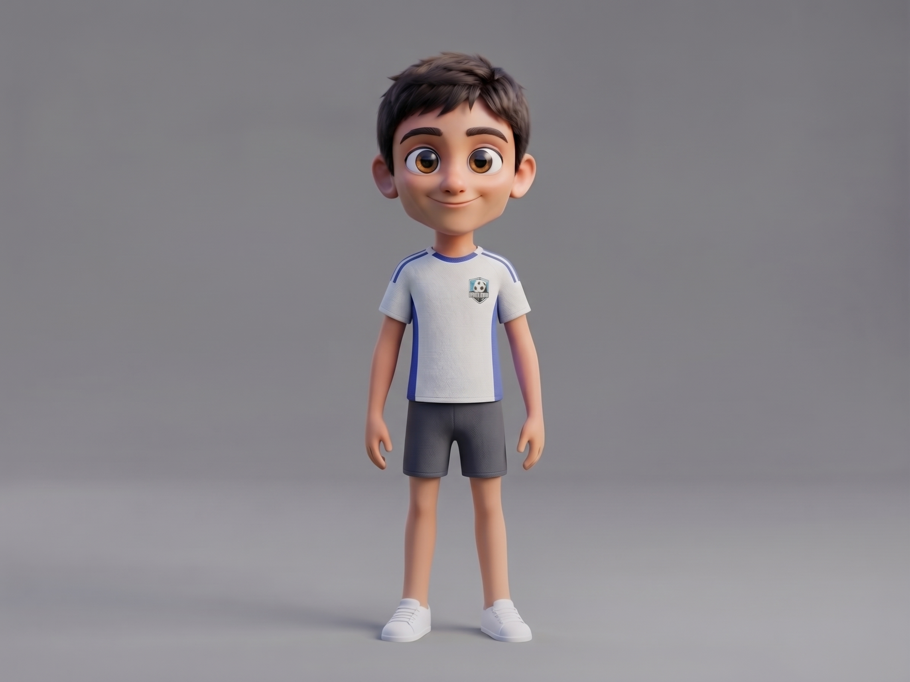

# Housam



> A teenage soccer prodigy who sees patterns on the field and solves difficult math problems for fun.

## Who he is

Housam is quick, curious, and quietly confident. His great soccer skill comes from practice, anticipation, and precise footwork. He is also exceptionally smart and a genius at mathematics; he likes working out angles, trajectories, and patterns. In a scene he can think through a problem, explain an idea, then turn the same insight into a clever play.

## Look

Based on the supplied reference: a slim teenager with a large expressive face, warm tan skin, big brown eyes, thick brows, and short tousled dark hair. He wears a white soccer jersey with blue shoulder piping, blue side panels, a small shield crest, charcoal shorts, and white low-top sneakers. The rig is an illustrated 2D interpretation of the supplied 3D image.

| Part | Colour |
|---|---|
| Skin / shadow | `#DCA887` / `#BC8068` |
| Hair / brows | `#282027` / `#34252B` |
| Iris | `#754622` |
| Jersey / piping | `#F1F0EA` / `#425DA0` |
| Shorts | `#363641` |
| Sneakers | `#F8F7F2` |

## Scale and controls

Housam is about **32 local units** tall. `HOUSAM_UNIT = 5.25` makes him about **168 world units** tall; use `s = HOUSAM_UNIT * P.k(Z)` in a perspective set. `(x, y)` is the floor point between his feet.

```js
const A = housam(x, y, s, {
  t, dy, lean, tilt, turn, rot, jump, sq, flip, breathe,
  handL, handR, footL, footR,       // [x, y] targets in local units
  handPoseL, handPoseR,             // 'open' | 'palm' | 'point' | 'fist'
  eyes,                             // 'open' | 'wide' | 'happy' | 'closed' | 'wink' | 'squeeze'
  brows,                            // 'normal' | 'up' | 'focused' | 'worried'
  mouth,                            // 'smile' | 'smirk' | 'grin' | 'open' | 'o' | 'flat' | 'frown' | 'wobble'
  lookX, lookY, blink, blush,
});
// A: head, mouth, top, eyeL, eyeR, chest, belly,
//    handL, handR, footL, footR, kneeL, kneeR (screen pixels)

housamBall(x, y, s, { spin, radius }); // screen-space ball centre
housamNotebook(x, y, s, { ang });     // screen-space notebook centre
housamDribble(p, k);                  // pure pose options for step phase p
```

The arms and legs use two-bone IK, so hands and feet can be placed independently for scene-specific actions. `housamDribble` ties the stepping phase to travel distance (`p = distance / stride`) to help avoid sliding feet.

## Registered poses

rest · hello · ready · dribble · kick · juggle · thinking · math genius · eureka! · laugh · surprised.

The ball and notebook are optional props in their respective browser poses. The reference image is a visual guide and contains no instructions for the rig.

## Files

| File | Purpose |
|---|---|
| `asset.js` | Studio manifest |
| `housam.js` | Rig, props, motion helper, and poses |
| `reference.jpeg` | Supplied visual reference |
