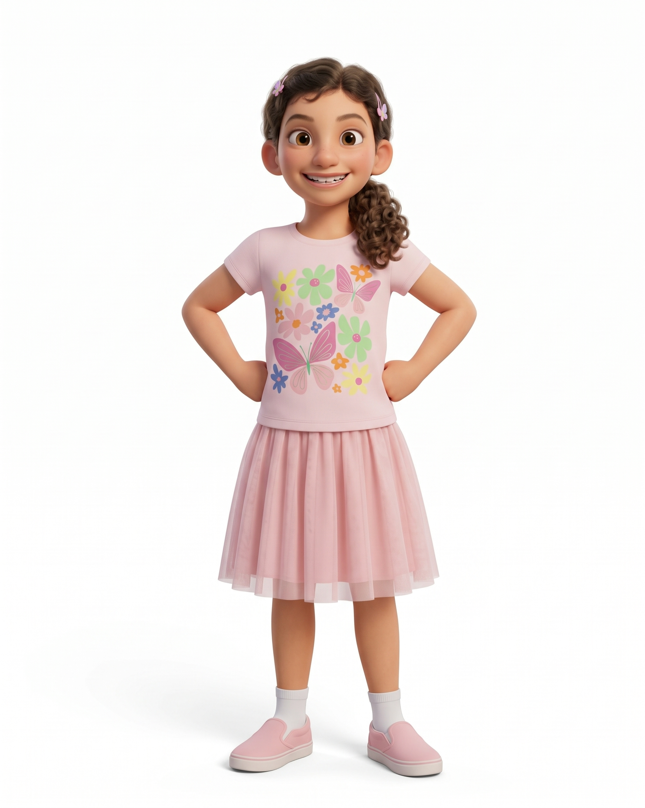

# Jenna



> Alma's funny 9 year old cousin who likes gymnastics, drawing, creating stories and comics.

## Who she is

Jenna is Alma's cousin. She is a funny 9-year-old girl who likes gymnastics and drawing. She also likes creating stories and comics. She is very creative.

## Look

Based on the supplied reference, she wears a pale pink T-shirt with pastel flowers and two butterflies, a pleated knee-length pink tulle skirt, ribbed white socks, and pink slip-on shoes with white soles. She has warm light brown skin (`#DFB197`), large brown eyes, visible ears, and brown wavy hair (`#4E372A`) tied into a curly side ponytail over her right shoulder. Two small pink butterfly clips hold the front waves back.

## Proportions and scale

About 27 local units tall. `JENNA_UNIT = 5.0` makes her about 135 world units tall. `(x, y)` is the floor point between her feet; `s` is pixels per local unit.

## Poses

Registered in `jenna.js` (`CHARACTERS.jenna.poses`): rest · hi! · talk · giggle · surprised · wink · shy · sad · skip · dance: bounce · dance: disco · dance: twirl · dance: star jump · dance: floss · super dance.

## Rig API (`jenna.js`)

```js
const A = jenna(x, y, s, { /* pose + face options */ });
// A (screen px): head, mouth, top, eyeL, eyeR, chest, belly, handL, handR, footL, footR
```

## Files

| File | What |
|---|---|
| `asset.js` | manifest: title, logline, files, docs, reference art |
| `jenna.js` | the rig + registered poses |
