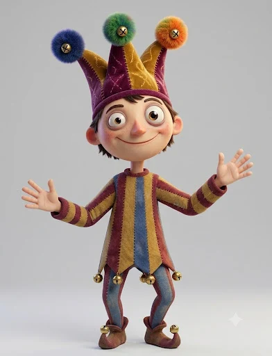

# Jester Fester



> The court jester: juggles, tells chicken jokes, gets bonked. It is the story of his life.

## Who he is

Fester is the royal court jester. He is cheerful, eager to please and endlessly optimistic. Every trick he tries goes *almost* right, and the universe (usually in the form of a juggling ball) finds his head. He never stays down for long: he shakes it off, straightens his hat, shrugs at the camera and grins.

- **Wants:** to make the court laugh, and above all to impress Princess Pearl.
- **Good at:** juggling (3 and 5 balls), tumbling (somersaults, ta-da landings), hat tricks (balls pop out of his hat).
- **Bad at:** jokes (his chicken joke is ancient) and luck.
- **Catchphrase:** *"…and this is the story of my life."*
- **Voice / acting:** big, bright, a little too eager. Jazz hands. Laughs at his own jokes. When it goes wrong: a sheepish shrug, never anger.

## Look

A slim jester with a big round head.
- **Hat:** three points (plum, crimson, gold) with blue, green and orange pompoms, each with a gold bell, and a crimson headband with gold stitching.
- **Face:** big brown eyes, a rosy bulb nose, pink cheeks, a wide smile, and brown hair poking out under the band.
- **Tunic:** striped crimson / gold / blue with a ruffled collar and a zig-zag hem with gold bells.
- **Sleeves and tights:** crimson / gold striped sleeves and crimson tights with blue bands.
- **Shoes:** brown curly-toed shoes with bells.

| Part | Colour |
|---|---|
| Hat | plum `#6E2D5E` · crimson `#A8284C` · gold `#E4AE3E` |
| Pompoms | blue `#3F5FC4` · green `#4FAA4F` · orange `#EF8B2C` |
| Tunic | crimson, gold `#E4AE3E`, blue `#4568B5`; gold bells `#F3C54F` |
| Tights / shoes | crimson with blue bands · brown `#8E5234` |
| Skin / hair / nose | `#F7CBAA` · `#6A3B22` · `#F29A84` |
| Ink (outlines) | `#3B2530` |

## Proportions and scale

He is about **27 local units** tall (feet to hat tips). `JF_UNIT = 6.3` world units per unit, so in a set he stands about 170 world units tall; use `s = JF_UNIT * P.k(Z)`.

| Landmark | Local y (up is negative) |
|---|---|
| feet | 0 |
| hips | −8.4 |
| shoulders | −13.3 |
| mouth | −15.6 |
| head centre | −17.3 |
| hat tips | ≈ −26 |

Handy hand targets:
- ta-da `(±5.3, −15.4)`
- at the hat brim `(±2.9, −20.6)`
- resting `(∓3.3, −8.4)`
- shrug `(±4.4, −13.3)`
- speech-bubble anchor beside the head `(±3.9, −16.6)`

## Poses

Registered in `jester_fester.js` (`CHARACTERS.jester_fester.poses`) and shown in the studio's character browser and model sheet:
rest · ta-da · juggle 3 · juggle 5 · talk · laugh · shrug · wink · surprised · dizzy · sad (fired) · somersault.

## Rig API (`jester_fester.js`)

```js
const A = jester(x, y, s, {
  // body
  dy, lean, tilt, turn, rot, jump, sq, flip, sway, boil,
  // limbs: IK wrist / ankle targets in local units
  handL: [x, y], handR: [x, y],
  handPoseL, handPoseR,        // 'open' | 'cup' | 'fist' | 'thumb'
  footL, footR,
  // face
  eyes,                        // open | wide | happy | closed | squeeze | swirl | x | star | wink
  lookX, lookY,
  blink,                       // auto-blinks every ~3.4 s unless given
  brows,                       // normal | up | worried | angry
  mouth,                       // smile | grin | open | o | O | flat | frown | wobble | teeth | smirk
  blush,
  // hat
  hatSway: [dx, dy],
  hatDroop,                    // 0..1: the points flop down (sad)
  hatAskew, hatLift, hatDrop,
  // extras
  stars,                       // 0..1 dizzy stars
  emote, emoteK,               // '?' | '!' | '!?' | 'sweat' | 'music' | 'heart'
});
// A (screen px): head, mouth, hatTip (top of the middle pompom), hatTipL, hatTipR, handL, handR, belly, top
```

## Juggling (`juggling.js`)

```js
const c = cascade(t, { n: 3, tau: .34, h: 17, t0 });   // n odd · tau = seconds between throws · h = peak height (units)
jester(x, y, s, { handL: c.handL, handR: c.handR, handPoseL: 'cup', handPoseR: 'cup' });
c.balls.forEach(b => jugglerBall(x + b.x * s, y + b.y * s, BALL_R * s, b.col, b.rot));
```

- Before `t0`, the right hand holds balls 0 and 2 and the left hand holds ball 1. Animate balls *into* those hold positions (e.g. popping out of the hat).
- To start mid-pattern, set `t0` a few throws before the shot begins (`t0 = shotStart - 10 * tau`).
- `JUGGLE_COLS`: blue, green, orange, crimson, gold. `BALL_R = .85` units.

## Files

| File | What |
|---|---|
| `asset.js` | manifest: title, logline, files, docs, reference art |
| `jester_fester.js` | the rig + his registered poses |
| `juggling.js` | the cascade pattern and the juggling balls |
| `reference.webp` | reference art (the look we match) |
