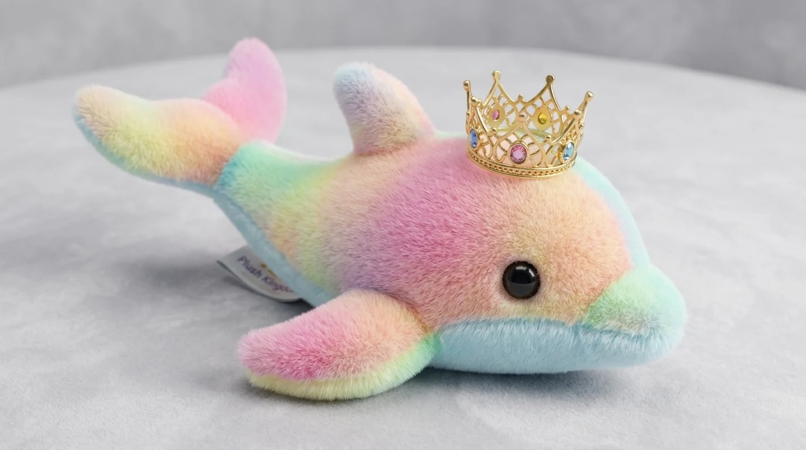

# Princess Pearl



> A plush rainbow dolphin who rules from the throne. Regal, easily bored, zero patience for chicken jokes.

## Who she is

Princess Pearl rules the court from her pink-and-gold throne. She is a small plush dolphin with a very large sense of occasion. She expects to be dazzled, is almost never dazzled, and says so. Her boredom is legendary: heavy lids, slow blinks, enormous yawns. When she has had enough, she is decisive and dramatic.

- **Wants:** to be entertained, properly, immediately.
- **Manner:** deadpan, then imperious. Few words, perfectly timed ("…why?").
- **Tells:** a slow blink means you're losing her, an eye-roll means you've lost her, a raised flipper means you're finished.
- **Catchphrase:** *"Somebody find me another jester!"*
- **Relationship to Fester:** she fired him (scene 02), but he is the story's hero, so this won't be the end of it.

## Look

A chubby plush dolphin.
- **Body:** pastel rainbow tie-dye (yellow, mint, peach, pink, lavender) with soft fur flecks and a fuzzy edge.
- **Belly and beak:** pale blue.
- **Eye:** a big glossy black bead eye with lashes, and a pink blush.
- **Crown:** a small gold filigree crown with pink, blue and yellow gems. It sits on top of her head and glints every few seconds.

| Part | Colour |
|---|---|
| Tie-dye | yellow `#FBE79B` · mint `#A9EBCB` · peach `#FBC6A0` · pink `#F5A2C6` · lavender `#D4B5EC` |
| Belly / beak | sky `#A8DDF2` |
| Eye / lid / blush | bead `#1E1620` · lid `#F6BBB0` · blush `#F48DB0` |
| Crown | gold `#EDC04D` / `#B98A22` / `#FFE9A0`; gems pink, blue, yellow |
| Ink (outlines) | softer plum `#5B3552` |

## Proportions and scale

Her body is built along a bendable **spine** (tail base → nose) with a thickness profile: a round melon head, a stubby beak and a thin tail stock.
- She is about 24 units nose to tail lying flat, and about 18 units tall sitting.
- `PP_UNIT = 10`, so sitting she is about 180 world units tall, the same height as Fester.
- `(x, y)` is the **surface point under her middle** (floor or seat); the rig centres her body on it. On the throne, use the throne room's *Throne seat* spot `(0, 258, 2275)`.

## Poses

Registered in `princess_pearl.js` (`CHARACTERS.princess_pearl.poses`) and shown in the studio:
lying (photo) · sitting · bored · talk · yawn · FIRED! · nose up · eye roll · happy · surprised · turn around.

## Rig API (`princess_pearl.js`)

```js
const A = pearl(x, y, s, {
  // body
  sit,                      // 0 lying flat (the photo) … 1 upright, tail curled on the seat
  headTilt,                 // + = nose up (haughty, yawning)
  wag,                      // tail flick
  rot, sq, dy, breathe,
  flip,                     // true = faces LEFT
  turn,                     // 1 → −1 animates a turn-around
  // flippers
  flipNear, flipFar,        // angle offsets from resting
  point,                    // 0..1 swings the near flipper out to point
  pointAng,                 // world angle of the point (≈ −.2 = forward)
  // face
  eyes,                     // open | bored | closed | happy | angry | wide | sparkle
  lookX, lookY,
  blink,                    // auto every ~4 s unless given
  brows,                    // normal | up | flat | angry | worried
  mouth,                    // smile | flat | frown | open | yawn | smirk | o
  blush,
  // crown + extras
  crownTilt, crownLift,
  emote, emoteK,
});
// A (screen px): head (the eye), mouth, nose, crown, flipper (near tip), belly
```

Use `measure(() => pearl(...))` to get her anchors (e.g. her mouth, for a speech bubble) without painting her twice.

## Files

| File | What |
|---|---|
| `asset.js` | manifest: title, logline, files, docs, reference art |
| `princess_pearl.js` | the rig + her registered poses |
| `reference.webp` | reference photo (the plush we match) |
