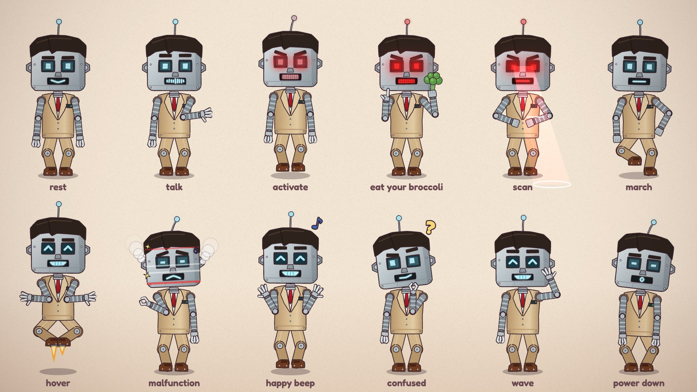

# Robo-Safadi



> The robot professor Alma and Jenna dreamed up for Halloween: Safadi's hair and suit on a riveted box body, LED eyes that ACTIVATE red, and one mission: **EAT. YOUR. BROCCOLI.**

## Who he is

Robo-Safadi began as a doodle in Jenna's sketchbook (scene 16, *The Spooky Plan*), the girls' revenge for one candy lecture too many. He's Professor Safadi with everything turned up to eleven and the warmth turned down to zero. He's a lecture machine that never needs a breath.

- **Wants:** every child to eat their vegetables. Immediately. *"EAT. YOUR. BROCCOLI."*
- **Powers:**
  - *ACTIVATE*: his eyes, mouth and antenna switch from cool cyan to glowing red (`red`)
  - a red scanning beam that sweeps the floor for candy (`scan`)
  - hover jets in his shoes (`hover`)
  - steam from his ear vents when he's overheating (`steam`)
- **Bad at:** jokes, sarcasm and Halloween. Too much candy makes him glitch: sparks, static, X-eyes and a drop of oil (`glitch`, `eyes: 'x'`, `emote: 'oil'`).
- **Voice and acting:** a flat, buzzy monotone in clipped, evenly spaced syllables (the `robot` voice style), with the odd low "error" drop or a high beep. He moves stiffly: marching, snapping his head round, holding poses a beat too long. Happy, he beeps (`eyes: 'happy'`, `emote: 'music'`).

## Look

He has the same silhouette and scale as Professor Safadi, so they can share spots and cameras, and a twin gag works.
- **Head:** a big riveted steel box (about 40% of his height) with hex-bolt ears, a jaw seam and a blinking antenna. Safadi's side-parted hair (with the flick) is moulded on top in dark enamel, and his thick brows are two movable bars.
- **Face:** square LED-screen eyes with scan lines and square pupils that follow `lookX` / `lookY`, a small metal wedge nose, and an LED mouth display over a speaker grill. Every mouth shape lights up on the display, and `'open'` is a bouncing equalizer.
- **Body:** a tan metal box painted like Safadi's suit, with notch lapels, a white shirt plate, a red tie and two buttons. The breast pocket is a status panel with blinking lights. Ribbed flex-tube arms with ball joints end in steel grippers. Boxy tan legs with knee bolts stand on brown oxford blocks.

| Part | Colour |
|---|---|
| Steel (light / base / dark) | `#DCE3E7` · `#BAC4CA` · `#8C98A0` |
| Hair plate / brows | `#2E221D` |
| Suit (base / shade / lapels) | `#D4B68C` · `#B7966B` · `#E4CDA7` |
| Shirt / tie | `#F2F0EA` · `#C3222F` |
| Shoes | `#6E3B22` |
| LEDs: calm / ACTIVATED | `#BFF3FF` · `#FF2E2E` |
| Jets | `#FFB23A` |
| Ink (outlines) | `#3B2530` (shared with the cast) |

## Proportions and scale

He is about **29.6 local units** tall to the top of the hair plate, and **31.4** to the antenna ball. `ROBO_SAFADI_UNIT = 6.0` world units per unit (Safadi's), so in a set he stands about 178 world units tall, and about 189 with the antenna. Use `s = ROBO_SAFADI_UNIT * P.k(Z)`.

| Landmark | Local y (up is negative) |
|---|---|
| feet | 0 |
| hips | −8.5 |
| shoulders | −15.8 |
| chin | −17.4 |
| eyes / mouth | −22.7 / −20.6 |
| hair top / antenna ball | −29.6 / −31.4 |

## Poses

Registered in `robo_safadi.js` (`CHARACTERS.robo_safadi.poses`), shown on the model sheet (`node render.mjs --modelsheet=robo_safadi`):

rest · talk · activate (powers up from dark eyes to red) · eat your broccoli · scan · march · hover · malfunction · happy beep · confused · wave · power down

## Rig API (`robo_safadi.js`)

```js
const A = roboSafadi(x, y, s, {
  // pose:   dy, lean, tilt, turn, jump, rot, sq, flip, hum (idle vibration, default on)
  // limbs:  handL / handR [x, y] targets, handPoseL / handPoseR: 'open' | 'palm' | 'point' | 'fist' | 'claw'
  //         footL / footR, broccoli: 'L' | 'R'
  // face:   eyes: 'open' | 'wide' | 'happy' | 'closed' | 'squint' | 'off' | 'x' | 'heart', lookX, lookY, blink
  //         brows: 'normal' | 'up' | 'worried' | 'angry' | 'quizzical'
  //         mouth: 'smile' | 'grin' | 'open' | 'o' | 'O' | 'flat' | 'frown' | 'smirk' | 'teeth' (lipFlap works)
  // powers: red, scan, steam, hover, glitch (all 0..1), antenna (lean, rad)
  // extras: emote: '?' | '!' | '!?' | 'oil' | 'music' | 'heart', emoteK
});
// A (screen px): head, mouth, top, antenna, eyeL, eyeR, chest, belly, handL, handR, footL, footR
const walk = roboSafadiWalk(p, k);   // the stiff march: spread into the options (p = steps travelled, k = 0..1)
```

- **Activating him:** ramp `red` from 0 to 1 over about 0.25 s, with `eyes: 'off'` → `'open'` just before it. Add a `kick` on `jump` and `antenna` for the jolt.
- **Voice:** give him lines in a scene's `dialogue` with `speaker: 'robo_safadi'`. Use `callout(…, { kind: 'robot' })` for his bubble.
- **With the real Safadi:** both rigs share the same scale, hip height and hand reach, so the same hand targets work for both.

## Files

| File | What |
|---|---|
| `asset.js` | manifest: title, logline, files, docs, reference art, the `robot` voice |
| `reference.jpg` | the model sheet (all poses) |
| `robo_safadi.js` | the rig, its powers, the march and the registered poses |
