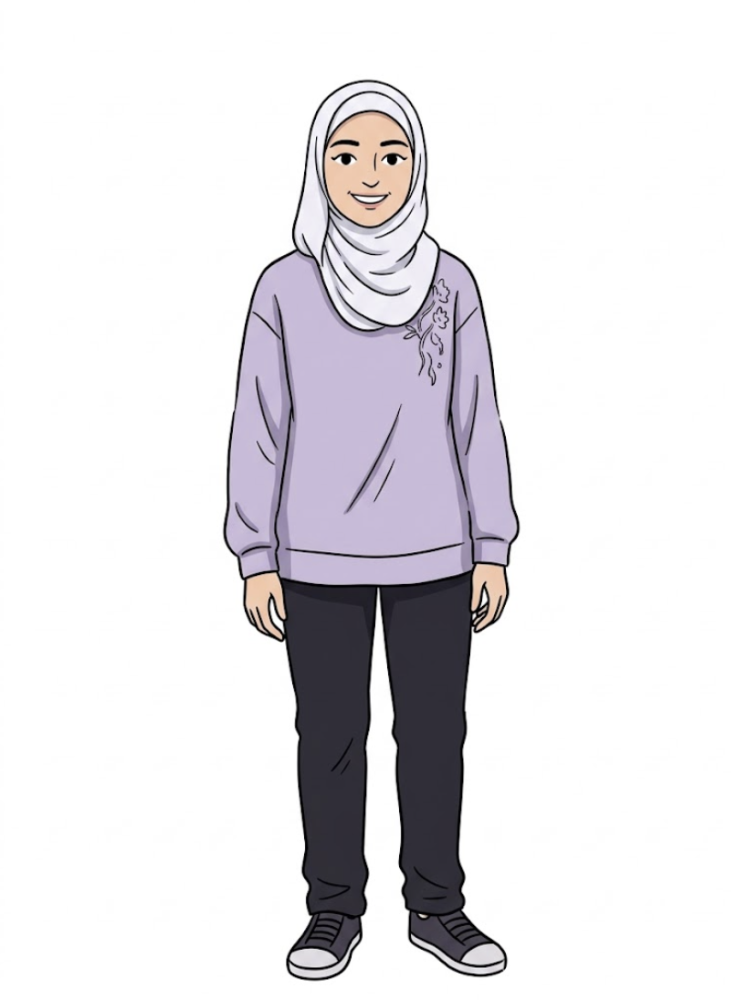

# Roudaynah



Roudaynah is a loving, busy mom and an avid programmer. Her superpower is love: she makes time to listen, comfort, and encourage even on a full day. Her other superpower is turning laptop time into original ideas. Her busy poses stay cheerful and purposeful.

The supplied full-body cartoon reference guides her adult proportions, warm peach complexion, brown eyes, dark curved brows, toothy smile, and pale silver-lilac hijab. She wears a lavender long-sleeved top with cuffs, a hem band, and floral embroidery on one shoulder, long charcoal trousers, and dark lace-up sneakers with white toe caps and soles. Her head and scarf are smaller in proportion to her body than in the original rig.

## Rig

`roudaynah(x, y, s, options)` uses a floor origin between the feet and pixels per local unit. At about 35 local units tall, `ROUDAYNAH_UNIT = 4.9` gives an adult standing height of about 172 world units. It returns screen-pixel anchors: `head`, `top`, `mouth`, `eyeL`, `eyeR`, `chest`, `belly`, `handL`, `handR`, `kneeL`, `kneeR`, `footL`, `footR`, plus `laptop` and `idea` when their props are drawn.

```js
const A = roudaynah(x, y, s, {
  t, dy: 0, lean: 0, tilt: 0, turn: 0, rot: 0, jump: 0, sq: 0,
  flip: false, handL: [-4.3, -14.5], handR: [4.3, -14.5],
  footL: [-1.7, -1], footR: [1.7, -1],
  eyes: 'open', // open | wide | narrow | happy | closed | wink
  mouth: 'smile', // smile | grin | open | flat | frown
  brows: 'normal', // normal | up | worried | angry
  handPoseL: 'open', handPoseR: 'open', // open | fist
  lookX: 0, lookY: 0, blink: 0, // omit blink for automatic blinking
  laptop: false, love: 0, ideas: 0, busy: false,
  boil: .35, noShadow: false,
});
```

`handL/handR` and `footL/footR` are local targets for two-bone IK. `dy`, `lean`, and `tilt` move the torso and head; `jump`, `rot`, `sq`, and `flip` transform the whole figure and its props. All motion is a pure function of time.

## Abilities and poses

```js
roudaynahPerform(x, y, s, t, 'love', { k: 1 });
roudaynahPerform(x, y, s, t, 'coding');
roudaynahPerform(x, y, s, t, 'ideas');
roudaynahPerform(x, y, s, t, 'busy');
roudaynah(x, y, s, { ...roudaynahAbility(t, 'hug'), t });
```

`roudaynahAbility(t, ability, options)` returns pose options; `roudaynahPerform` draws them with any overrides. `k` (0–1) controls the love and idea effects. Laptop poses show a supported open laptop, animated code, and tapping fingers. The idea power sends little connected invention cards and a glowing bulb up from the laptop. Love sends rising hearts from her chest and open hands. Busy mom has a brisk stepping cycle, wristwatch, and an animated checklist.

Registered poses: rest, hello, listening, talk, warm hug, busy mom, programming, original ideas, love superpower, happy, thinking, reassuring, upset, sad, angry, mad.

The four new emotions also work with `roudaynahAbility` and `roudaynahPerform`: **upset** folds her arms and looks away with concerned brows; **sad** lowers her gaze and slumps gently; **angry** plants her feet with hands on her hips, narrowed eyes, and a scowl; **mad** clenches her fists, opens her mouth, and stamps one foot. Each pose includes time-based motion.

| File | Purpose |
|---|---|
| `asset.js` | Studio manifest, reference, and warm voice profile |
| `roudaynah.js` | Drawing rig, IK, laptop and power effects, ability helpers, poses |
| `reference.png` | Full-body cartoon reference for the updated rig |
| `reference.jpeg` | Original photograph and cartoon face |
