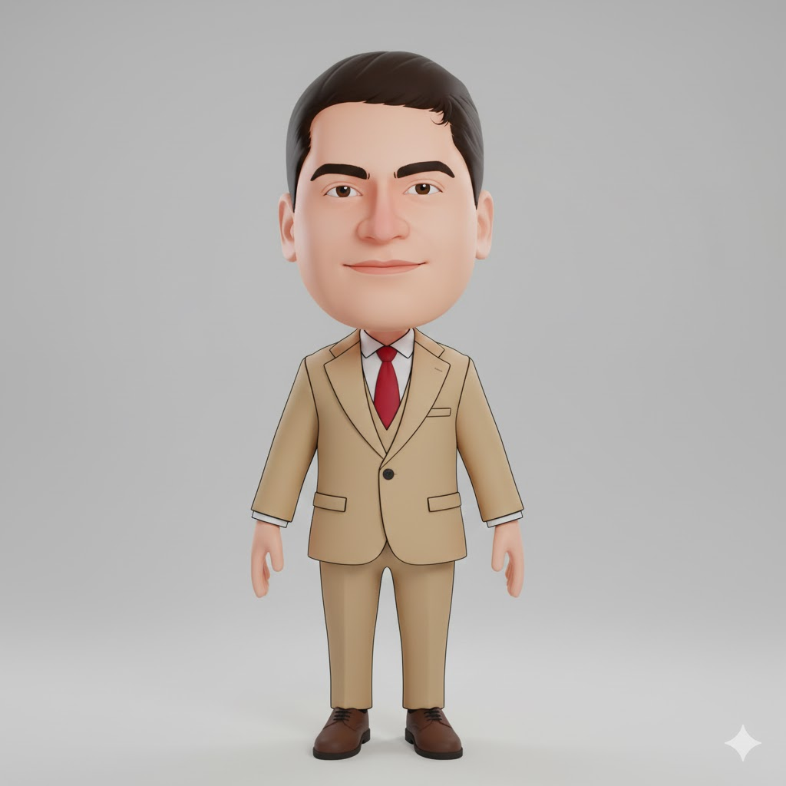

# Professor Safadi



> A big-headed professor in a tan three-piece suit with **super explanatory powers**: when he explains something, the air fills with glowing chalk formulas, idea bulbs pop over his head, and chalkboards appear out of thin air.

## Who he is

Safadi is a professor. He is calm, kind and a little formal, and nothing makes him happier than the moment someone *gets it*. Give him a confusing idea and his eyes light up. The explanation arrives with a golden-cyan glow and a ring of chalk formulas orbiting him, and a holographic chalkboard draws itself beside him.

- **Wants:** everyone to understand everything, especially the hard parts.
- **Super explanatory powers:**
  - *the aura*: a glow, light rays and orbiting formulas (E=mc², π, ∑, √x…)
  - *glowing eyes and hands*
  - *the idea bulb*
  - *the floating chalkboard*: graphs, numbered steps, atoms, light bulbs, storybooks
- **Props:** a telescoping pointer with a red tip that glows when his power is on.
- **Bad at:** stopping. Every answer grows a footnote.
- **Voice / acting:** warm, measured, a patient smile. He gestures with open palms and raises an index finger for "the key point". He goes quizzical (one brow up) when he hears a wrong idea, then comes back with a big delighted grin.

## Look

A stylised bobble-head: the head is about 40% of his height and as wide as his shoulders.
- **Head:** a round, full face with a soft jaw. Short dark hair with a side part on screen-left, a small flick over the forehead and short sideburns.
- **Face:** thick, dark, tapered brows; warm brown almond eyes; a broad, soft nose; a calm closed-mouth smile.
- **Suit:** a tan three-piece suit (notch lapels, one button, flap pockets, a breast-pocket welt, and a vest showing in the V), with a white shirt and a red tie.
- **Shoes:** brown oxfords.

| Part | Colour |
|---|---|
| Skin / cheeks | `#F3C6A8` · `#EE9A8E` |
| Hair / brows | `#2E221D` · `#2A1D18` |
| Eyes (iris) | `#6B3A1F` |
| Suit (base / shade / lapels + vest) | `#D4B68C` · `#B7966B` · `#E4CDA7` |
| Shirt / tie | `#F8F6F1` · `#C3222F` |
| Shoes | `#6E3B22` |
| Powers (glow / gold / chalk / board) | `#7FE3FF` · `#FFD66B` · `#FFFDF4` · `#23433A` |
| Ink (outlines) | `#3B2530` (shared with the cast) |

## Proportions and scale

He is about **29.5 local units** tall (feet to hair top). `SAFADI_UNIT = 6.0` world units per unit, so in a set he stands about 177 world units tall, a touch taller than Fester. Use `s = SAFADI_UNIT * P.k(Z)`.

| Landmark | Local y (up is negative) |
|---|---|
| feet | 0 |
| hips / jacket hem | −8.0 |
| shoulders | −15.2 |
| chin | −17.0 |
| mouth | −19.6 |
| head centre | −23.0 |
| hair top | ≈ −29.5 |
| idea bulb | ≈ −33 |

Handy hand targets (wrists; mirror x for the left hand):
- rest `(±4.4, −8.1)`
- talking palm `(5.3, −12.6)`
- explain, both palms `(±5.3, −12.4)`
- point up `(5.8, −21.4)` with `handPoseR: 'point'`
- hand to chin `(0.8, −16.1)` with `'fist'`
- surprised `(±4.6, −15.6)`
- super-power reach `(±5.6, −14.2)`
- pointer `(4.4, −12.2)` with `'pointer'`
- speech-bubble anchor beside the head `(±4.6, −21)`

## Poses

Registered in `safadi.js` (`CHARACTERS.safadi.poses`) and shown in the studio's character browser and model sheet:
rest · talk · explain · point up · pointer · thinking · idea! · super explain · surprised · laugh · wink · walk · shrug.

## Rig API (`safadi.js`)

```js
const A = safadi(x, y, s, {
  // body
  dy, lean, tilt, turn, rot, jump, sq, flip, breathe,
  // limbs: IK wrist / ankle targets in local units
  handL: [x, y], handR: [x, y],
  handPoseL, handPoseR,        // 'open' | 'palm' | 'point' | 'fist' | 'thumb' | 'pointer'
  pointerAng, pointerLen,      // the pointer stick (screen angle, rad; length in units)
  footL, footR,
  // face
  eyes,                        // open | wide | happy | closed | wink | squeeze | narrow | glow
  lookX, lookY,
  blink,                       // auto-blinks every ~3.9 s unless given
  brows,                       // normal | up | worried | angry | quizzical | focused
  mouth,                       // smile | grin | open | o | O | flat | frown | smirk | teeth | wobble
  blush,                       // 0..1
  // powers
  power,                       // 0..1: aura, rays, glowing hands, orbiting chalk formulas
  bulb,                        // 0..1: the idea bulb pops on above his head
  // extras
  emote, emoteK,               // '?' | '!' | 'sweat' | 'music' | 'heart'
});
// A (screen px): head, mouth, top, eyeL, eyeR, chest, belly, handL, handR, pointerTip, bulb

safadiBoard(x, y, w, k, t, { kind, title });   // floating chalkboard at screen (x, y), width w px
// k 0..1: pops in (0–.2), then the drawing chalks itself on (.2–1)
// kind: 'graph' | 'steps' | 'atom' | 'bulb' | 'story' | 'plate' (healthy plate) | 'crash' (sugar spike vs steady veggies)

safadiWalk(p, k)   // walk-cycle pose options: p = steps travelled (distance / ~58 world units), k = stride amount 0..1
safadi(x, y, s, { ...safadiWalk(dist / 58, speedK), turn: -.3 });
```

**Animating the powers:** ramp `power` with `ease(seg(t, a, b))`, and switch `eyes: 'glow'` once power passes about .5. Pop `bulb` with a quick 0 → 1 over 0.25 s. Put the board beside his raised palm (for example `x = A.handR[0] + 5 * s`) and drive `k` from 0 to 1 over 1.5–2.5 s while he talks. Everything is a pure function of `t`.

## Files

| File | What |
|---|---|
| `asset.js` | manifest: title, logline, files, docs, reference art |
| `safadi.js` | the rig, his powers (aura, formulas, bulb, `safadiBoard`) and registered poses |
| `reference.jpg` | reference art (the look we match) |
