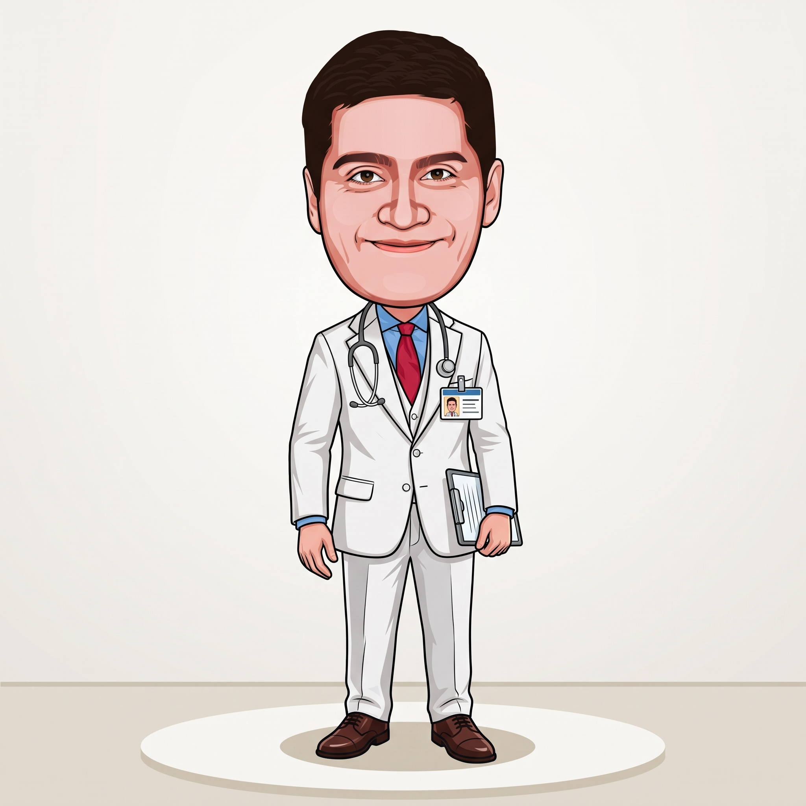

# Doctor Sami



> A big-headed doctor in a white coat with a warm smile. He is Professor Safadi's twin brother! He is a smart, humble doctor who loves educating kids about health in a funny, approachable way. When he explains health concepts, glowing medical and health icons appear, and a holographic medical chart draws itself beside him.

## Who he is

Sami is a doctor and the twin brother of Professor Safadi. While Safadi is formal, Sami is goofy and playful, always finding the fun in learning how the body works. Nothing makes him happier than a kid learning how to stay healthy.
- **Wants:** to keep kids healthy and make them smile.
- **Super explanatory powers:**
  - *the aura*: a soft mint-green glow with orbiting health icons (♥, ✚, 🍎, 🩹)
  - *glowing eyes and hands*
  - *the idea bulb*
  - *the floating chalkboard/chart*: healthy plates, sugar crashes, heart rates, germs
- **Props:** a stethoscope.
- **Bad at:** taking his own advice to rest (he works too hard!).
- **Voice / acting:** warm, funny, upbeat. He uses big, goofy gestures to get kids laughing. 

## Look

A stylised bobble-head identical in proportion to his twin brother Safadi.
- **Head:** same as Safadi, with a kind and playful expression.
- **Face:** thick, dark, tapered brows; warm brown almond eyes; a broad, soft nose; a calm closed-mouth smile.
- **Clothes:** a white doctor's coat over blue scrubs, with a stethoscope around his neck.
- **Shoes:** comfortable white sneakers.

| Part | Colour |
|---|---|
| Skin / cheeks | `#F3C6A8` · `#EE9A8E` |
| Hair / brows | `#2E221D` · `#2A1D18` |
| Eyes (iris) | `#6B3A1F` |
| Coat | `#FDFDFD` |
| Scrubs | `#4C86A8` |
| Shoes | `#F0F0F0` |
| Powers | `#8AE5B3` (mint glow) |
| Ink (outlines) | `#3B2530` (shared with the cast) |

## Proportions and scale

He is about **29.5 local units** tall (feet to hair top). `SAMI_UNIT = 6.0` world units per unit, so in a set he stands about 177 world units tall. Use `s = SAMI_UNIT * P.k(Z)`.

| Landmark | Local y (up is negative) |
|---|---|
| feet | 0 |
| hips / coat hem | −8.0 |
| shoulders | −15.2 |
| chin | −17.0 |
| mouth | −19.6 |
| head centre | −23.0 |
| hair top | ≈ −29.5 |
| idea bulb | ≈ −33 |

Handy hand targets (wrists; mirror x for the left hand):
- rest `(±4.4, −8.1)`
- talking palm `(5.3, −12.6)`
- explain, both palms `(±5.3, −12.4)`
- point up `(5.8, −21.4)` with `handPoseR: 'point'`
- hand to chin `(0.8, −16.1)` with `'fist'`
- surprised `(±4.6, −15.6)`
- super-power reach `(±5.6, −14.2)`
- stethoscope `(±2.5, −11.5)`

## Poses

Registered in `sami.js` (`CHARACTERS.sami.poses`) and shown in the studio's character browser and model sheet:
rest · talk · examine · explain · point up · thinking · idea! · super explain · surprised · laugh · wink · walk · shrug.

## Rig API (`sami.js`)

```js
const A = sami(x, y, s, {
  // body
  dy, lean, tilt, turn, rot, jump, sq, flip, breathe,
  // limbs: IK wrist / ankle targets in local units
  handL: [x, y], handR: [x, y],
  handPoseL, handPoseR,        // 'open' | 'palm' | 'point' | 'fist' | 'thumb' | 'stethoscope'
  footL, footR,
  // face
  eyes,                        // open | wide | happy | closed | wink | squeeze | narrow | glow
  lookX, lookY,
  blink,                       // auto-blinks every ~3.9 s unless given
  brows,                       // normal | up | worried | angry | quizzical | focused
  mouth,                       // smile | grin | open | o | O | flat | frown | smirk | teeth | wobble
  blush,                       // 0..1
  // powers
  power,                       // 0..1: aura, rays, glowing hands, orbiting health icons
  bulb,                        // 0..1: the idea bulb pops on above his head
  // extras
  emote, emoteK,               // '?' | '!' | 'sweat' | 'music' | 'heart'
});
// A (screen px): head, mouth, top, eyeL, eyeR, chest, belly, handL, handR, bulb

samiBoard(x, y, w, k, t, { kind, title });   // floating medical chart at screen (x, y), width w px
// k 0..1: pops in (0–.2), then the drawing chalks itself on (.2–1)
// kind: 'plate' (healthy plate) | 'crash' (sugar spike vs steady veggies) | 'germs' | 'heart'

samiWalk(p, k)   // walk-cycle pose options: p = steps travelled, k = stride amount 0..1
sami(x, y, s, { ...samiWalk(dist / 58, speedK), turn: -.3 });
```

## Files

| File | What |
|---|---|
| `asset.js` | manifest: title, logline, files, docs, reference art |
| `sami.js` | the rig, his powers (aura, health icons, bulb, `samiBoard`) and registered poses |
| `reference.jpeg` | reference art (the look we match) |
