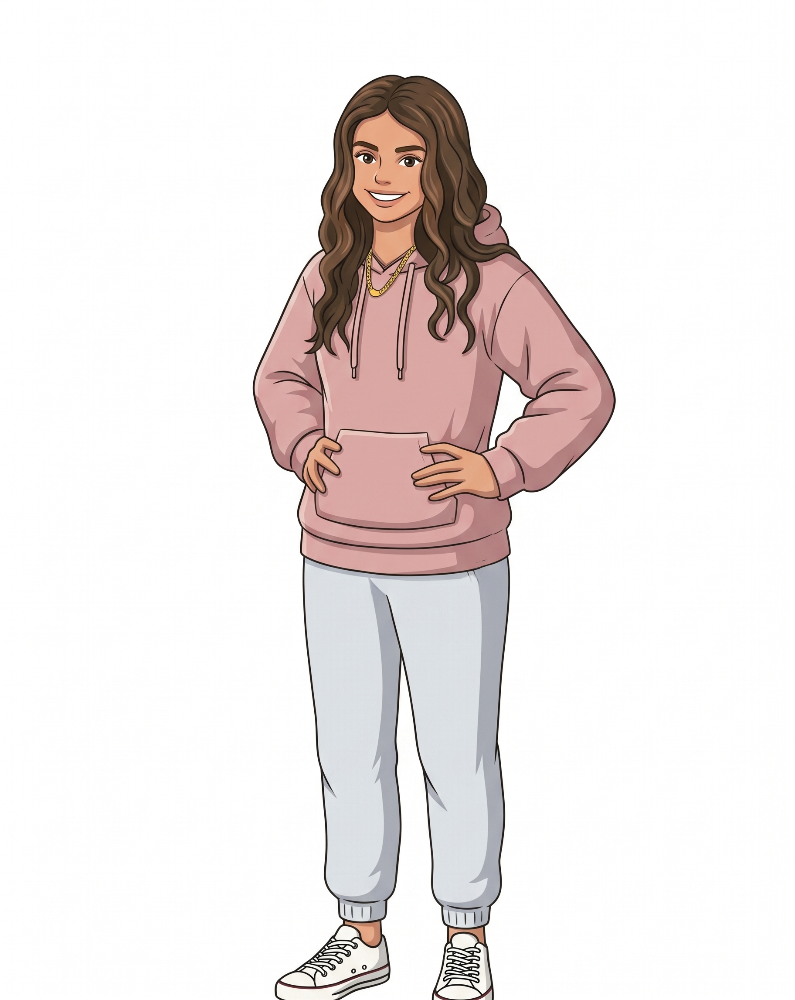

# Sarah



Sarah is a rebellious **ninth-grade teenager** who loves woodworking, texting on her phone, and playing volleyball. She is independent, quick with a dry remark, and proud of the things she builds.

The supplied reference guides her long, center-parted wavy brown hair, brown eyes and lashes, warm skin, dusty pink hoodie with drawstrings and a kangaroo pocket, gold chain, light gray joggers, and cream canvas sneakers. Her teenage silhouette is about 35 local units tall; `SARAH_UNIT = 4.8` gives a standing height of roughly 168 world units. The studio reserves 40 units of height for upright rebellion hair and volleyball poses.

## Drawing and poses

`sarah(x, y, s, options)` returns screen-pixel anchors: `head`, `mouth`, `top`, `eyeL`, `eyeR`, `chest`, `belly`, `handL`, `handR`, `kneeL`, `kneeR`, `footL`, and `footR`. `(x, y)` is the floor point between her feet; `s` is pixels per local unit. All animation is a pure function of time and options.

```js
const A = sarah(x, y, s, {
  t, dy: 0, lean: 0, tilt: 0, turn: 0, rot: 0, jump: 0, sq: 0,
  flip: false, hairSwing: 0,
  handL: [-2.9, -14.9], handR: [2.9, -14.9],
  footL: [-1.65, -1.05], footR: [1.65, -1.05],
  handPoseL: 'open', handPoseR: 'open', // open | palm | fist
  eyes: 'open', // open | wide | happy | closed | wink
  brows: 'normal', // normal | up | angry
  mouth: 'grin', // grin | open | smile | smirk | flat | frown
  lookX: 0, lookY: 0, // -1..1
  blink: 0, // omit for automatic blinking
  rebellion: 0, // 0..1: raised hair, red angry eyes, lightning accents
  phone: false, woodworking: false,
  boil: .4, noShadow: false,
});
```

Registered model-sheet poses: rest, hello, hands on hips, unimpressed, texting on phone, woodworking, volleyball set, volleyball spike, rebellion bout, and cooling down.

## Abilities

Use `sarahPerform(x, y, s, t, ability, options)` to draw a complete ability including its props. It returns the same anchors as `sarah()`. `options.k` controls the energy of woodworking, rebellion, and volleyball; pose overrides can be supplied in `options`.

| Ability | Behavior |
|---|---|
| `texting` | Holds a lit phone, looks down, taps the screen, and shows animated typing dots. |
| `woodworking` | Saws a clamped plank on a wooden workbench with a moving saw and falling shavings. |
| `volleyball set` | Raises both hands and follows a bobbing volleyball overhead. |
| `volleyball spike` | Jumps and swings her raised arm toward a spinning volleyball. |
| `rebellion` | Plants her feet, clenches her fists, frowns, turns her eyes red and angry, and raises her hair into upright spikes with red lightning accents. |

```js
sarahPerform(x, y, s, t, 'woodworking');
sarahPerform(x, y, s, t, 'texting');
sarahPerform(x, y, s, t, 'volleyball spike', { k: .8 });
sarahPerform(x, y, s, t, 'rebellion', { k: 1 });

// Pose options alone, for composing custom movements:
sarah(x, y, s, { ...sarahAbility(t, 'rebellion', { k: .7 }), t });
// Screen-space prop for custom ball paths:
sarahVolleyball(ballX, ballY, s, { spin: t * 2, radius: 1.35 });
```

`phone` and `woodworking` props inherit the character transform, including flipping and jumping. The volleyball supplied by `sarahPerform` follows a screen-space path above her; use `sarahVolleyball` for custom scene choreography.

| File | Purpose |
|---|---|
| `asset.js` | Studio manifest and voice profile |
| `sarah.js` | Standalone drawing rig, props, ability helpers, and registered poses |
| `reference.jpeg` | Supplied reference artwork |
