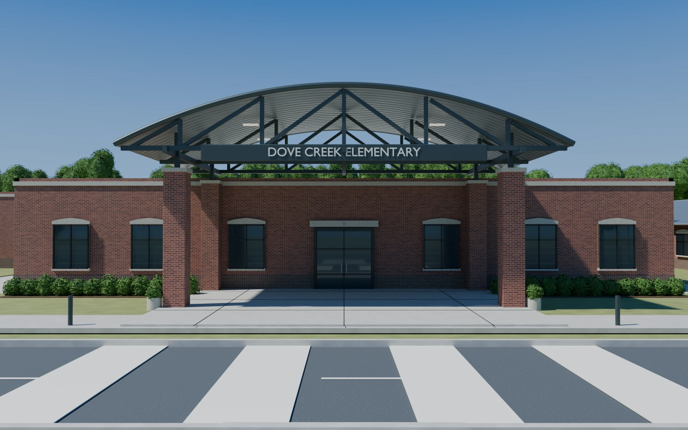
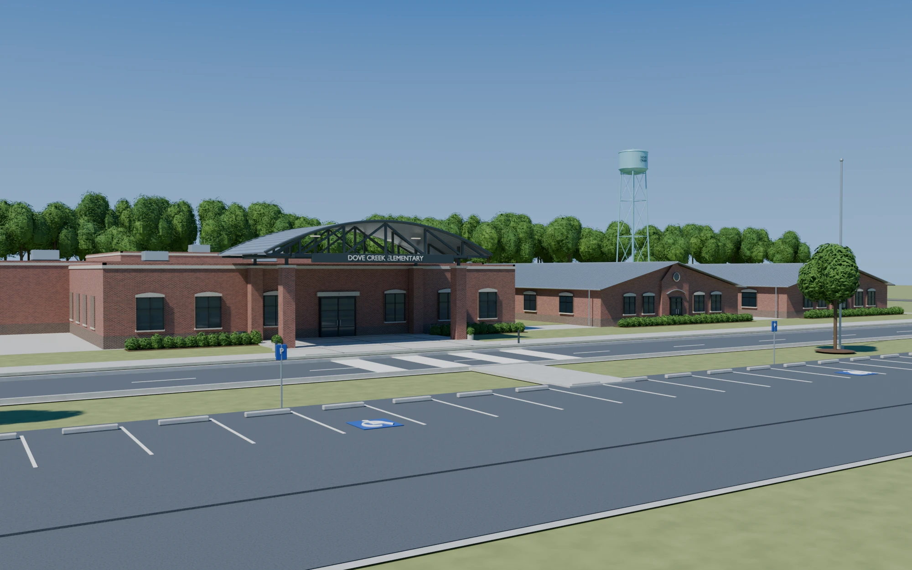
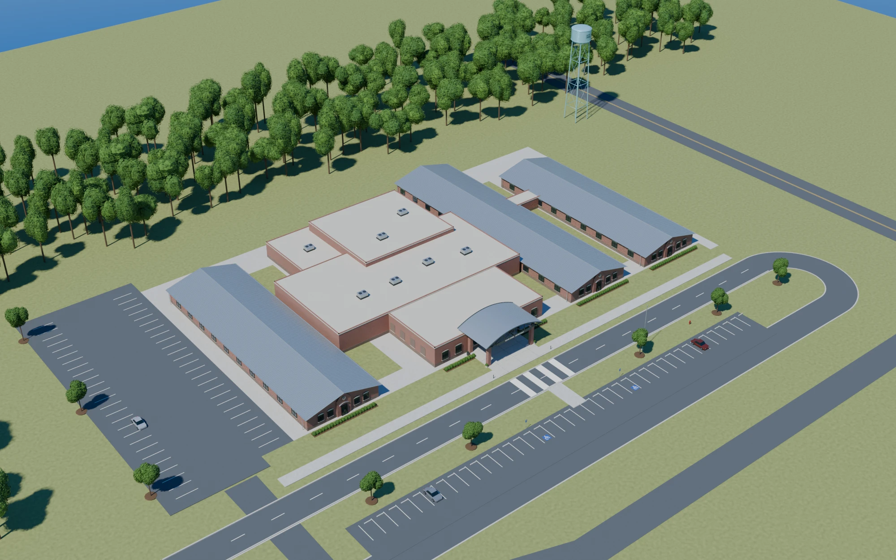

# Dove Creek Elementary (DCES)





> DCES from the street: red-brick school, arched steel entrance canopy, drop-off road, crosswalk and parking lot.

## Description

A single-storey, red-brick elementary school on a sunny day. Scenes are played **in front of the school**, on the entrance plaza, the front sidewalk and the crosswalk.
- **Entrance:** a flat-roofed brick block with stone coping, pilasters and segmental stone window heads. Glass double doors sit in the centre. Two brick piers carry an **arched standing-seam canopy** on a dark steel truss, with the **DOVE CREEK ELEMENTARY** sign board hung across the front.
- **Wings:** gable-roofed classroom wings with blue-grey metal roofs sit on either side, gable ends to the street. Each has an arched door, an oculus vent and paired windows. Flat brick links join them to the entry block. A taller gym/core block with rooftop units rises behind.
- **In front:** planters and shrub beds by the door, bollards, a flagpole on the right lawn, the front sidewalk, then a two-lane drop-off road with a zebra crosswalk. Beyond that are a grass median with trees and blue **P** signs, and a parking lot with accessible bays by the walk.
- **Behind:** a tall tree line and the **DOVE CREEK** water tower.
- **Motion:** trees and shrubs sway, the flag flutters, and clouds drift. Pass `wind` (0–2) to calm the scene or make it gusty.

**Mood:** bright, ordinary, a little suburban. It's the real-world counterpart to the castle.

## Layout (world units; a person is about 170 tall, 1 unit ≈ 1 cm)

X is right, Y is up (the ground is Y = 0), and Z goes away from the street toward the school.

| Feature | Where |
|---|---|
| Entry block | facade plane **Z 2600**, X ±1150, parapet Y 470 (pilasters X ±470 to Y 492) |
| Front door | X ±100, Y 0–250 |
| Piers | X ±600, front face Z 2245, 110 square, brick to Y 545 + stone cap |
| Canopy | X ±840, Z 2230–2600, arch Y 600 (ends) → 800 (middle); truss chord Y 585 |
| Sign | on the canopy's front, X ±470, Y 548–618 |
| Entry plaza | X ±610, Z 2150–2600 (planters at X ±495, Z 2275) |
| Shrub beds | X ±610…±1150, Z 2480–2600 |
| Front sidewalk | Z 2050–2150 (bollards X ±700, Z 2130) |
| Drop-off road | Z 1350–1990, centre line Z 1670, crosswalk X ±300 |
| Median | Z 1180–1350, walk X ±230, trees X ±900 / ±2100, P signs X ±540 |
| Parking lot | Z 380–1180, stalls Z 700–1180 every 270, accessible bays X ±385 |
| Flagpole | X 1350, Z 2300, 1380 tall |
| Wings | left X −2600…−1500 (gable Z 2700), right X 1500…2500 (Z 2900) and 2900…3900 (Z 3300); eaves Y 420, ridge ≈ 650 |
| Core / gym | X ±1300, Z 3400–5200, Y 720 |
| Tree line, water tower | Z 5600–8200; tower X 2600, Z 9500 |

## Spots (where characters go)

| Spot | (X, Y, Z) | Used for |
|---|---|---|
| Entrance mark (`dces.MARK`) | (0, 0, 2200) | centre stage: in front of the doors, between the piers |
| Under the canopy | (−160, 0, 2480) | sheltering by the doors |
| Front sidewalk | (−700, 0, 2100) | walking up, waiting for a ride |
| Crosswalk | (0, 0, 1670) | crossing the road |
| Median walk | (0, 0, 1265) | stepping off the parking lot |
| Flagpole | (1250, 0, 2330) | on the lawn by the flag |
| Parking lot | (500, 0, 560) | arriving by car |

For a character under the canopy, pass `splitZ` = its Z. The piers (Z 2245) then draw over it, as they should.

## Camera presets

In the studio's location browser (click one, then **Copy camera**), or `node render.mjs --location=dces --character=jester_fester`:
- **Entrance** `{ x: 0, y: 200, z: 1150, f: 1000, hy: 600 }`: the reference framing, with canopy, sign and crosswalk
- **Street wide** `{ x: 0, y: 330, z: -700, f: 1400, hy: 520 }`: the whole front from the parking lot
- **On the mark** `{ x: 0, y: 130, z: 1500, f: 1000, hy: 700 }`: full body on the mark, with the sign overhead
- **Medium** `{ x: 0, y: 120, z: 1820, f: 1000, hy: 640 }`: waist-up acting in front of the doors
- **Crosswalk** `{ x: -120, y: 150, z: 1000, f: 900, hy: 600 }`
- **Low hero** `{ x: 150, y: 50, z: 1900, f: 800, hy: 700 }`
- **Parking lot** `{ x: 600, y: 160, z: 200, f: 1000, hy: 560 }`
- **Aerial** `{ x: 0, y: 2200, z: -1600, f: 900, hy: -100 }`: establishing shot

## API (`dces.js`)

```js
dces.back(P, t, { splitZ, wind })    // sky, ground, road, school, and every prop farther than splitZ
dces.front(P, t, { splitZ, wind })   // props nearer than splitZ (median trees, signs, bollards, piers…), over the characters
dces.MARK, dces.FZ (facade Z), dces.BW (facade half width), dces.ROAD, dces.LOT, dces.spots, dces.cameras
```

## Files

| File | What |
|---|---|
| `asset.js` | manifest: title, logline, files, docs, reference art |
| `dces.js` | the 3D set, its spots and camera presets |
| `reference_entrance.webp`, `reference_street.webp`, `reference_aerial.webp` | reference renders (the look we match) |
