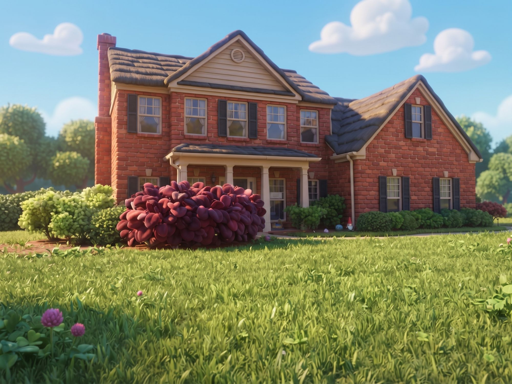

# House



> A two-storey red-brick family house across its front lawn: cream cross gable, columned porch, clover in the grass.

## Description

A suburban two-storey home on a sunny late afternoon, seen from the front lawn. Scenes play **on the lawn, the garden walk and the front porch**.
- **Main block:** red brick, two storeys, side-gabled dark shingle roof. A **cream-sided cross gable** with a round louvred vent sits over the porch. The windows are white six-over-six sashes with lace curtains, soldier-course lintels, and black louvred shutters on some of them. A tall **brick chimney** with a shoulder rises on the left end.
- **Front porch:** a concrete slab with one step, four white columns, a white beam with a gutter, a shingled shed roof, a white front door with sidelights, and a lantern.
- **Right wing:** a one-and-a-half-storey brick wing that steps forward, with its gable to the street. It has two shuttered windows below and one above.
- **Garden:** a red-mulch bed runs along the front with a **lime-green** bush and a dark green shrub to its left, green shrubs along the wing, and a red bush on the corner. By the walk are a **garden gnome** and two gazing balls. A concrete walk runs from the porch step to the right, and a driveway runs beside the wing.
- **Lawn:** striped grass with clover patches and **pink clover blooms**. Grass tufts appear near the camera, so low shots get a textured foreground.
- **Behind:** a neighbour's hedge, rounded trees, and big puffy clouds.
- **Motion:** trees, bushes, clover and grass sway, and clouds drift. Pass `wind` (0–2).
- **Autumn:** pass `season: 'autumn'` for orange, red and gold trees, a warmer lawn, fallen leaves on the grass, and leaves drifting down in front of everything (drawn by `house.front`). Used by scene 16.

**Mood:** warm, homey and ordinary. It's a family home.

## Layout (world units; a person is about 170 tall, 1 unit ≈ 1 cm)

X is right, Y is up (the ground is Y = 0), and Z goes from the lawn toward the house.

| Feature | Where |
|---|---|
| Main block | facade plane **Z 3000**, X −760…380, eaves Y 560, ridge Y 930 at Z 3420, back Z 3900 |
| Cross gable | X −460…220, peak X −120, Y 950; face Z 2985 |
| Chimney | X −885…−755, Z 3060–3240, top Y 1030 |
| Front door | X −90, sill Y 25 (porch floor) |
| Porch | X −480…260, Z 2700–3000, floor Y 25, step X −170…0 at Z 2655; columns X −440, −220, 20, 225; roof Y 300 → 380 |
| Right wing | X 380…1150, gable face Z 2880, eaves Y 300, ridge Y 720 |
| Mulch beds | in front of the house, out to Z ≈ 2640–2760 |
| Garden walk | Z 2600–2680, X −170…3200 |
| Driveway | X 1400…2300, Z 2680–3600 |
| Gnome, gazing balls | X 470 / 420 / 350, Z ≈ 2730 |
| Trees | Z 3200–6800 |

## Spots (where characters go)

| Spot | (X, Y, Z) | Used for |
|---|---|---|
| Front lawn (`house.MARK`) | (0, 0, 2000) | centre stage, on the grass |
| On the porch | (−90, 25, 2860) | at the front door (pass `splitZ` = 2860 so the columns draw over) |
| Porch steps | (−85, 0, 2620) | arriving, leaving, sitting on the step |
| Garden walk | (900, 0, 2640) | walking along the front of the wing |
| By the gnome | (580, 0, 2660) | |
| Driveway | (1850, 0, 2400) | getting out of a car |
| Lawn corner | (−900, 0, 1500) | |

Anything with Z below `splitZ` (clover, bushes, grass tufts) is painted over the characters by `house.front`. That gives free foreground layering for a character standing in the grass.

## Camera presets

In the studio's location browser (click one, then **Copy camera**), or `node render.mjs --location=house --character=jester_fester`:
- **Front** `{ x: 200, y: 60, z: 1650, f: 1000, hy: 800 }`: the reference framing, low across the lawn
- **Street wide** `{ x: 200, y: 170, z: -400, f: 1000, hy: 600 }`: establishing, from the street
- **On the lawn** `{ x: 0, y: 110, z: 1300, f: 1000, hy: 700 }`: full body on the mark, with the whole house behind
- **Medium** `{ x: 0, y: 120, z: 1600, f: 1000, hy: 640 }`
- **Porch** `{ x: 150, y: 150, z: 2150, f: 1000, hy: 600 }`: the front door and the porch
- **Garden walk** `{ x: 750, y: 130, z: 1950, f: 1000, hy: 640 }`: the wing, shrubs and gnome
- **Clover close** `{ x: -380, y: 22, z: 1600, f: 900, hy: 820 }`: a bug's-eye view through the clover
- **Low hero** `{ x: 300, y: 35, z: 1100, f: 800, hy: 800 }`
- **Aerial** `{ x: 200, y: 1800, z: -1200, f: 1000, hy: -60 }`

## API (`house.js`)

```js
house.back(P, t, { splitZ, wind, season })    // sky, lawn, walk, the house and every prop farther than splitZ
house.front(P, t, { splitZ, wind, season })   // props nearer than splitZ (bushes, clover, grass), over the characters
house.MARK, house.FZ (facade Z), house.WALK, house.PORCH, house.WING, house.spots, house.cameras
```

## Files

| File | What |
|---|---|
| `asset.js` | manifest: title, logline, files, docs, reference art |
| `house.js` | the 3D set, its spots and camera presets |
| `reference_front.jpg` | reference render (the look we match) |
