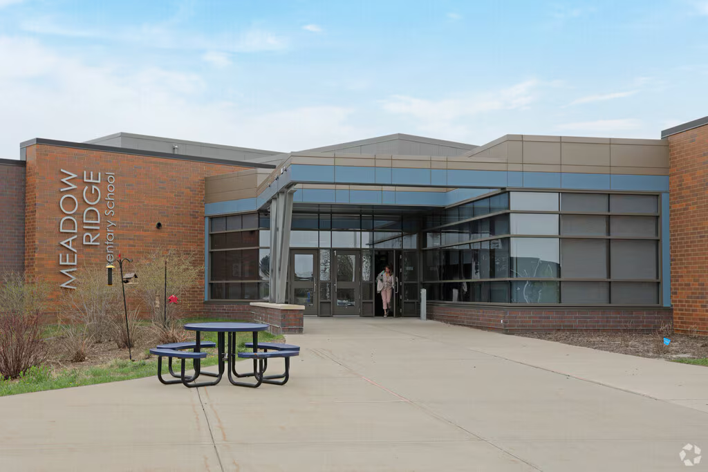

# Meadow Ridge Elementary School



A reusable outdoor set based on the supplied entrance photograph of Meadow Ridge Elementary School in Plymouth, Minnesota. Like Dove Creek, it uses world-space geometry, camera presets and separate background/foreground passes for character staging.

The reference's distinctive features are the orange-brown brick wings, flat taupe parapets, blue fascia, recessed glass double doors, broad gridded windows, silver canopy columns on brick bases, vertical school lettering and a blue round picnic table. The concrete approach is bordered by grass, mulch and sparse shrubs. Clouds drift and shrubs sway. Areas outside the photograph are simplified extensions for camera movement.

## Layout and staging

World axes: X right, Y up, Z toward the school; one unit is approximately one centimetre.

| Feature | Position |
| --- | --- |
| Recessed entrance doors | X ±150, Z 2800, height 260 |
| Glass wings | X −950…−330 and 330…1450, Z 2510 |
| Brick wings | X −2000…−950 and 1450…2300, Z 2490 |
| Entry canopy | X ±380, Z 2360…2800, height 420 |
| Silver columns and brick bases | X ±350, Z 2380 |
| Entrance mark | (0, 0, 2240) |
| Picnic table | (−680, 0, 1780) |
| Courtyard | X ±1200, Z 800…2800 |

## API

```js
const R = LOCATIONS['meadow-ridge-elementary-school'];
R.back(P, t, { splitZ: R.MARK.z, wind: 1 });
// Draw characters here using P.p() and their rig's world unit scale.
R.front(P, t, { splitZ: R.MARK.z, wind: 1 });
```

`MARK`, `FZ`, `spots` and `cameras` are exposed. Use the same `splitZ` in both passes. Props are sorted using camera depth, including reverse views. Presets: Entrance, Courtyard wide, On the mark, Medium, Picnic table, Aerial.

Preview: `node render.mjs --location=meadow-ridge-elementary-school --character=jester_fester`.
