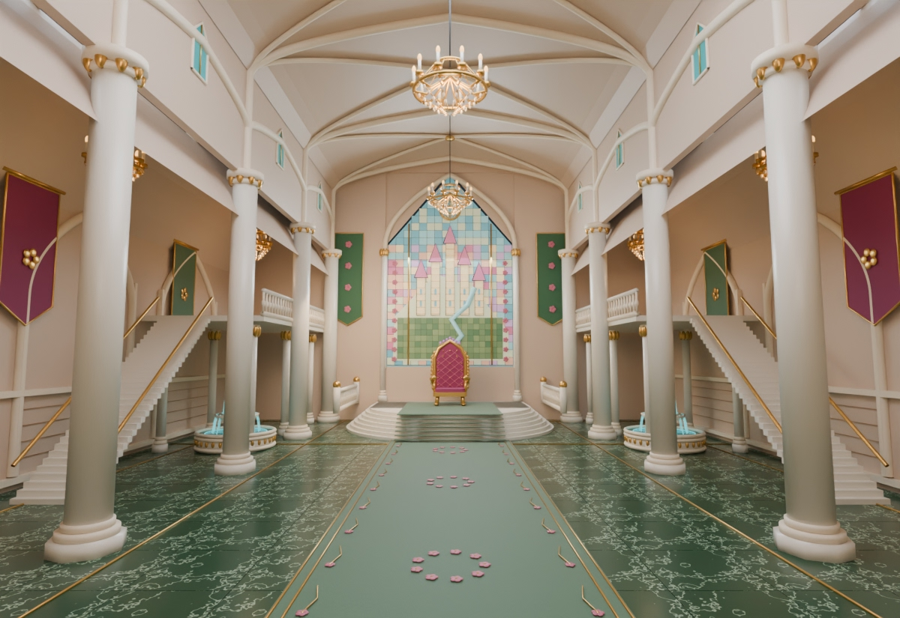
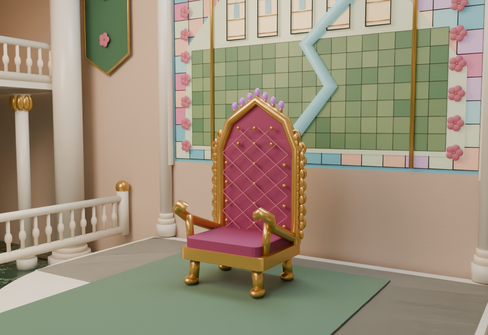

# Throne room




> The pastel royal hall: columns, stained glass, a pink-and-gold throne on a round dais, chandeliers.

## Description

The heart of the castle, and Princess Pearl's court. It is a long, bright hall in candy pastels:
- **Walls and ceiling:** pink walls and a cream vaulted ceiling with ribs.
- **Columns:** tall cream columns with gold capitals marching down both sides.
- **Floor:** dark-green marble with pale swirls and gold inlay lines. A sage-green carpet runner, scattered with pink petals, leads up to the throne.
- **Throne end:** a stained-glass window of a pastel castle struck by a zig-zag bolt. Below it, a pink quilted throne with a gold frame and lilac finials sits on a three-step round dais.
- **Around the hall:** galleries with balustrades run along both side walls, with staircases rising to them. There are arched doorways, crimson and green banners, fountains, and two chandeliers with flickering candles.
- **Light:** soft light shafts pour through the window, with dust motes drifting in them.

**Mood:** sunny, royal, a little silly. It is a stage, and everything that happens here is a performance.

## Layout (world units; a person is about 170 tall)

X is right, Y is up (the floor is Y = 0), Z goes into the room.

| Feature | Where |
|---|---|
| Walls | side walls X = ±800 · back wall Z = 2400 · cornice Y 1000 · vault up to ≈ 1260 |
| Stained-glass window | back wall, X ±250, Y 150–1085 |
| Dais | 3 semicircular steps in front of the back wall; bottom step's front edge ≈ Z 2090 |
| Throne | plane Z 2290, base Y 108, **seat cushion top Y 258**, seat X ±124 |
| Carpet runner | X ±160, from the entrance to the dais |
| Columns | X ±520 at Z 620 / 1050 / 1500 / 1950 |
| Galleries / stairs | along both side walls; stairs rise from Z 880 (floor) to Z 1350 (gallery floor Y 520) |
| Fountains | X ±400, Z 1650 |
| Chandeliers | X 0 at Z 1300 (ring Y 760; balls can lodge in it) and Z 2000 |

## Spots (where characters go)

| Spot | (X, Y, Z) | Used for |
|---|---|---|
| Stage mark (`throneRoom.MARK`) | (0, 0, 1200) | performing in the middle of the hall (scene 01) |
| Before the dais | (−200, 0, 1880) | addressing the throne (scene 02) |
| Throne seat | (0, 258, 2275) | Pearl on her throne |
| Left gallery | (−720, 520, 1700) | watching from above |

## Camera presets

In the studio's location browser (click one, then **Copy camera**):
- **Wide hall** `{ x: 0, y: 170, z: -250, f: 1000, hy: 540 }`
- **Stage mark** `{ x: 0, y: 120, z: 820, f: 1000, hy: 640 }`
- **Throne close-up** `{ x: -60, y: 330, z: 1985, f: 1000, hy: 644 }`
- **Chandelier** `{ x: 0, y: 110, z: 940, f: 1000, hy: 2200 }`
- **Left gallery** `{ x: -380, y: 420, z: 700, f: 850, hy: 560 }`
- **Low & grand** `{ x: 0, y: 40, z: 200, f: 800, hy: 700 }`

## API (`throne_room.js`)

```js
throneRoom.back(P, t, { splitZ, chandKick: [t0, strength], beams: 1 })  // everything farther than splitZ
throneRoom.front(P, t, { splitZ })                                   // nearer columns, drawn over the characters
throneRoom.chandelierSlot(t, o, i)   // world [X, Y, Z] of ball slot i (0..4) on the swinging near chandelier
throneRoom.MARK, throneRoom.spots, throneRoom.cameras, throneRoom.BACK, throneRoom.HW
```

## Files

| File | What |
|---|---|
| `asset.js` | manifest: title, logline, files, docs, reference art |
| `throne_room.js` | the 3D set, its spots and camera presets |
| `reference_hall.jpg`, `reference_throne.jpg` | reference renders (the look we match) |
